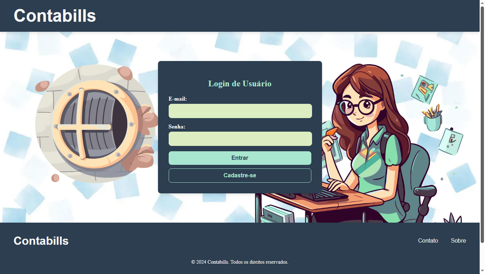

# Contabills

Este é o repositório **back-end** do **Contabills**, um sistema desenvolvido para auxiliar escritórios de contabilidade na gestão de empresas clientes, com foco na organização e controle de informações legais e contábeis.



---

## Sumário

- [Visão Geral](#visão-geral)
- [Arquitetura da Solução](#arquitetura-da-solução)
- [Pré-requisitos](#pré-requisitos)
- [Instalação e Execução](#instalação-e-execução)
- [Endpoints](#endpoints)
- [Contribuição](#contribuição)
- [Licença](#licença)

---

## Visão Geral

O **Contabills** surgiu a partir da necessidade de otimizar o trabalho em escritórios contábeis, especialmente na área legal. Durante minha experiência profissional, constatei que muitos processos eram realizados manualmente, gerando retrabalho e desperdício de tempo. Assim, decidi desenvolver uma solução que facilitasse a gestão, diminuísse erros e aumentasse a produtividade.

**Principais benefícios:**
- **Gerenciamento completo de empresas**: cadastro, atualização e exclusão de dados legais, contábeis e de capital social.
- **Controle integrado de procurações, certificados e parcelamentos**.
- **Interface intuitiva e responsiva**: perfil de dados completo com busca de endereço via CEP.
- **Integração total entre front-end e back-end**, garantindo agilidade e segurança na manipulação das informações.

> **Observação:** Este repositório contém apenas o **back-end** (API em Java/Spring). Para executar o sistema completo, é necessário também o repositório do **front-end**. Você pode acessá-lo [aqui](https://github.com/gersonreismelo/contabills-frontend).


---

## Arquitetura da Solução

O **Contabills** é composto por dois principais módulos:

1. **API (Back-end)**  
   Desenvolvida em Java/Spring Boot, esta camada gerencia a lógica de negócio e a persistência de dados.

2. **Front-end**  
   Responsável pela interface do usuário, permitindo a interação com os endpoints do back-end e proporcionando uma experiência moderna e intuitiva.

**Fluxo básico:**
1. O usuário acessa a aplicação via navegador.
2. O front-end envia requisições à API.
3. A API processa as requisições e interage com o banco de dados.
4. As respostas são exibidas na interface, permitindo uma gestão eficiente dos dados.

---

## Pré-requisitos

- **Node.js** (versão 16 ou superior)
- **npm** ou **yarn** (gerenciadores de pacotes)
- **Angular CLI** (para execução do front-end)
- **Git** (para clonar o repositório)
- **Java 17** e **Maven** (para executar a API localmente)
- **Banco de dados** configurado no back-end

---

## Instalação e Execução

1. **Clone o repositório:**
   ```bash
   git clone https://github.com/gersonreismelo/contabills-backend
   ```

2. **Instale as dependências:**
   ```bash
    cd contabills-backend
    npm install
    # ou
    yarn install
   ```

3. **Execute o projeto:**
   ```bash
    mvn spring-boot:run
   ```
A API estará disponível em http://localhost:8080 (ou conforme configurado).

4. **Acesse a documentação via Swagger (caso esteja habilitada):**
    
    Normalmente disponível em: http://localhost:8080/swagger-ui.html

## Endpoints

Abaixo um resumo simplificado dos endpoints do **Contabills** (API). Para detalhes completos, consulte o repositório do back-end ou a documentação do Swagger.

### Empresas
- **Listar Empresas**  
  `GET /empresas`  
  *Retorna todas as empresas cadastradas.*

- **Detalhes de uma Empresa**  
  `GET /empresas/{id}`  
  *Retorna os detalhes da empresa com o id informado.*

- **Cadastrar Nova Empresa**  
  `POST /empresas`  
  *Cria uma nova empresa com os dados informados.*

- **Atualizar Empresa**  
  `PUT /empresas/{id}`  
  *Atualiza os dados da empresa existente com o id informado.*

- **Excluir Empresa**  
  `DELETE /empresas/{id}`  
  *Exclui a empresa com o id informado.*

### Sócios
- **Listar Sócios**  
  `GET /socios`  
  *Retorna todos os sócios cadastrados.*

- **Detalhes de um Sócio**  
  `GET /socios/{id}`  
  *Retorna os detalhes do sócio com o id informado.*

- **Cadastrar Novo Sócio**  
  `POST /socios`  
  *Cria um novo sócio com os dados informados.*

- **Atualizar Sócio**  
  `PUT /socios/{id}`  
  *Atualiza os dados do sócio existente com o id informado.*

- **Excluir Sócio**  
  `DELETE /socios/{id}`  
  *Exclui o sócio com o id informado.*

### Parcelamentos
- **Listar Parcelamentos**  
  `GET /parcelamentos`  
  *Retorna todos os parcelamentos cadastrados.*

- **Detalhes de um Parcelamento**  
  `GET /parcelamentos/{id}`  
  *Retorna os detalhes do parcelamento com o id informado.*

- **Cadastrar Novo Parcelamento**  
  `POST /parcelamentos`  
  *Cria um novo parcelamento com os dados informados.*

- **Atualizar Parcelamento**  
  `PUT /parcelamentos/{id}`  
  *Atualiza os dados do parcelamento existente com o id informado.*

- **Excluir Parcelamento**  
  `DELETE /parcelamentos/{id}`  
  *Exclui o parcelamento com o id informado.*

### Usuários
- **Cadastrar Usuário**  
  `POST /api/usuarios/cadastro`  
  *Cria um novo usuário com os campos requisitados.*

- **Login do Usuário**  
  `POST /api/usuarios/login`  
  *Autentica o usuário e retorna um token JWT para acesso controlado.*

- **Listar Usuários**  
  `GET /api/usuarios`  
  *Retorna todos os usuários cadastrados*

- **Detalhes do Usuário**  
  `GET /api/usuarios/{id}`  
  *Retorna os detalhes do usuário com o id informado.*

- **Atualizar Usuário**  
  `PUT /api/usuarios/{id}`  
  *Atualiza os dados do usuário com o id informado. Essa operação permite alterar parcialmente campos como email, telefone e data de nascimento.*

- **Excluir Usuário**  
  `DELETE /api/usuarios/{id}`  
  *Exclui o usuário com o id informado.*

## Contribuição

Contribuições são bem-vindas! Para contribuir:

1. Fork este repositório.
2. Crie uma branch para sua feature ou correção: git checkout -b feature/nova-feature.
3. Faça commit das mudanças: git commit -m "Implementa nova feature".
4. Push para a branch: git push origin feature/nova-feature.
Abra um Pull Request descrevendo suas alterações.

## Licença

Este projeto é licenciado sob a [Licença MIT](./LICENSE). Fique à vontade para utilizar e adaptar o Contabills conforme necessário, respeitando os termos de uso.
